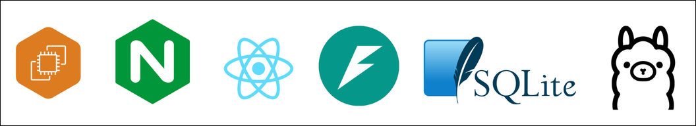
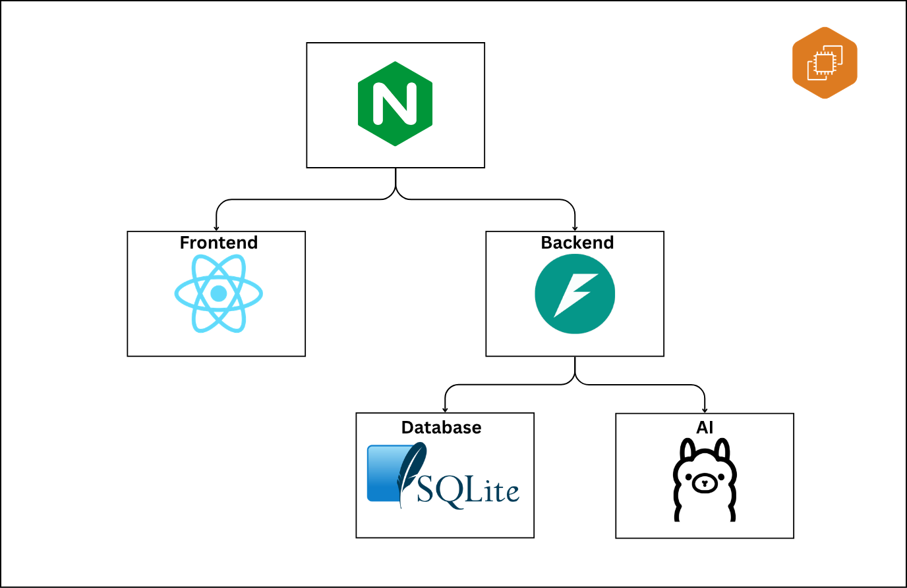
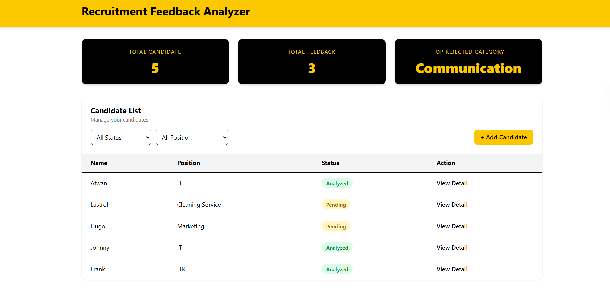
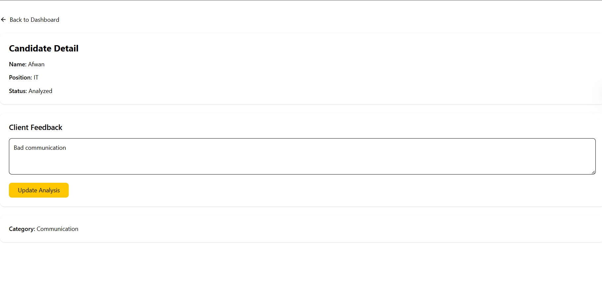

# Recruitment Feedback Analyzer

An AI-powered recruitment decision support system that helps recruiters transform unstructured client interview feedback into actionable insights through automated feedback classification.

## Overview

Recruitment teams often receive qualitative interview feedback from clients after candidate interviews. Since the feedback is typically unstructured, recruiters struggle to identify recurring rejection patterns and improve candidate preparation.

Recruitment Feedback Analyzer addresses this challenge by leveraging AI to automatically classify interview feedback into predefined categories, allowing recruiters to monitor recruitment insights through a centralized dashboard.

## Problem Statement

The client interview acceptance rate is relatively low (approximately **25%**), while recruiters lack a systematic approach to analyze historical interview feedback and identify recurring rejection factors.

## Features

- Add candidate information
- View candidate details
- Submit client interview feedback
- AI-powered feedback classification
- Dashboard with recruitment insights
- Filter candidates by position and status

## Tech Stack


# System Workflow

```text
Recruiter
    │
    ▼
Submit Candidate
    │
    ▼
Store Candidate
    │
    ▼
Select Candidate
    │
    ▼
Submit Interview Feedback
    │
    ▼
AI Classification
    │
    ▼
Store Analysis Result
    │
    ▼
Dashboard Visualization
```

# Solution Architecture


## Why These Technologies?

### React

React provides a modular and component-based architecture for building an interactive user interface.

### FastAPI

FastAPI was selected for its high performance, automatic Swagger documentation, and built-in request validation.

### SQLite

SQLite is lightweight and suitable for an MVP since it requires no separate database server.

### Ollama

Ollama enables local execution of open-source LLMs without relying on external AI APIs.

### Nginx

Nginx serves the React frontend while acting as a reverse proxy for FastAPI API requests.

### AWS EC2

EC2 hosts the complete application stack in a single deployment environment.


## Project Structure

```
RecruitmentFeedbackAnalyzer
│
├── frontend/
│   ├── src/
│   │   ├── components/
│   │   ├── pages/
│   │   ├── services/
│   │   ├── App.css
│   │   ├── App.jsx
│   │   ├── index.css
│   │   └── main.jsx
│   │
│   ├── public/
│   └── package.json
│
├── backend/
│   ├── app/
│   │   ├── main.py
│   │   ├── crud.py
│   │   ├── database.py
│   │   ├── analyze.py
│   │   ├── models.py
│   │   └── schemas.py
│   │
│   └── requirements.txt
│
└── README.md
```

---

## API Endpoints

| Method | Endpoint | Description |
|---------|----------|-------------|
| POST | /candidates | Create candidate |
| GET | /candidates/{id} | Get candidate detail |
| POST | /feedback/analyze | Analyze interview feedback |
| GET | /dashboard | Dashboard summary |

---

## Demo

### Dashboard



### Candidate Detail




## Installation

### Clone repository

```bash
git clone https://github.com/Afwanms/RecruitmentFeedbackAnalyzer.git

cd RecruitmentFeedbackAnalyzer
```

### Backend

```bash
cd backend

python -m venv venv

source venv/bin/activate

pip install -r requirements.txt

uvicorn app.main:app --reload
```

### Frontend

```bash
cd frontend

npm install

npm run dev
```